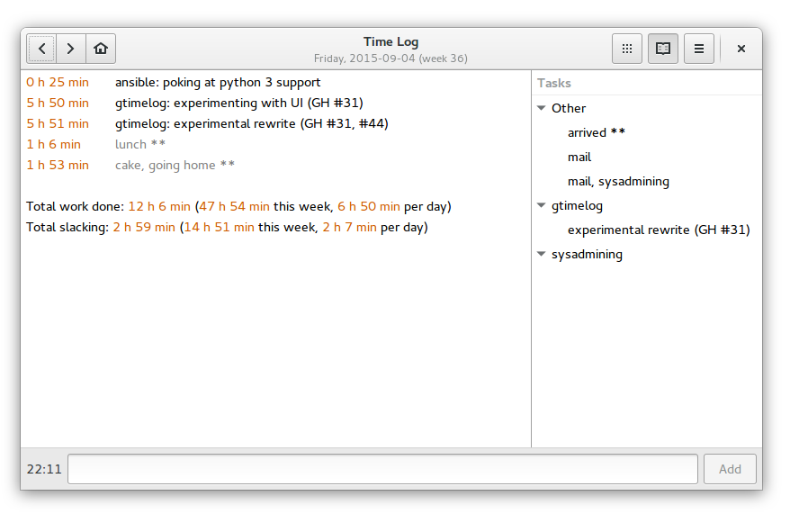

========
gtimelog
========

A time tracking app
~~~~~~~~~~~~~~~~~~~

GTimeLog is a small time tracking application for GNOME.  Its
main goal is to be as unintrusive as possible.

Documentation
=============

- `Overview <docs.html>`__
- `File formats <formats.html>`__

Download
========

You can get GTimeLog from the `Python Package Index`_::

    pip install gtimelog

Packages exist in Debian_ and in Ubuntu_, but they're outdated at the moment.

.. _Python Package Index: https://pypi.python.org/pypi/gtimelog
.. _debian: https://packages.debian.org/gtimelog
.. _ubuntu: https://packages.ubuntu.com/gtimelog

GTimeLog should in theory also run on Windows and Mac OS X, but I don't
have convenient installers.

Bugs
====

Please report bugs/feature requests on GitHub__.

__ https://github.com/gtimelog/gtimelog/issues

Source code
===========

The source code lives on GitHub__.  Get it with ::

    git clone https://github.com/gtimelog/gtimelog

__ https://github.com/gtimelog/gtimelog

Author
======

GTimeLog was written by `Marius Gedminas`_, with contributions from `many
others`_.  It is released under the terms of the `GNU GPL`_.

.. _Marius Gedminas: mailto:marius@gedmin.as
.. _many others: https://github.com/gtimelog/gtimelog/blob/master/src/gtimelog/CONTRIBUTORS.rst
.. _GNU GPL: https://www.gnu.org/copyleft/gpl.html

.. include:: footer.rst
